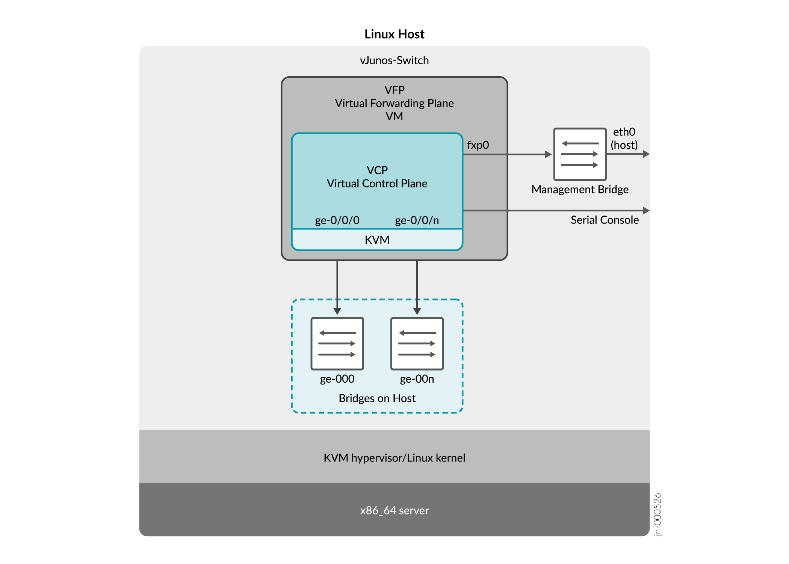
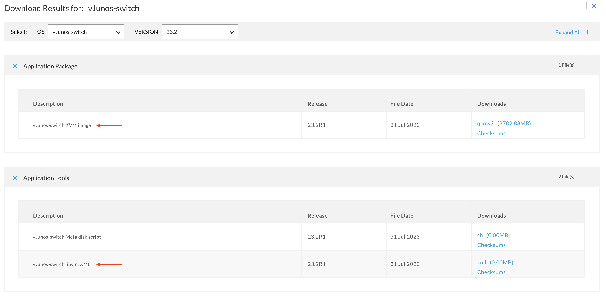

# vJunos-switch Deployment Guide for KVM
This tutorial will show how to install, deploy and manage the vJunos-switch on KVM. You will need a Linux server. I used Ubuntu 22.04 LTS.

## Introduction
The vJunos-switch is a virtual version of the Junos-based EX switching platform. It represents a Juniper switch running Junos® operating system (Junos OS) in the kernel-based virtual machine (KVM) environment. The vJunos-switch is based on Juniper Networks® vMX Virtual Router (vMX) ***nested*** architecture.

## Architecture
The vJunos-switch is a single, **nested** VM solution in which the virtual forwarding plane (VFP) and the Packet Forwarding Engine (PFE) reside in the outer VM. When you start the vJunos-switch, the VFP starts a nested VM that runs the Junos Virtual Control Plane (VCP) image. KVM hypervisor is used to deploy VCP.

The term **“nested”** refers to the VCP VM being nested within the VFP VM, as shown in Figure below.

The vJunos-switch can support up to 100 Mbps of throughput using 4 cores and 5GB of memory. Any additional cores and memory configured gets allocated to the VCP. VFP does not need additional memory apart from the minimum footprint supported. The 4 cores and 5GB memory is sufficient for lab use cases.



## Key Features Supported
This topic provides you the list and details of the key features that are supported and validated on vJunos-switch. For details on configuration of these features see the feature guides at: User Guides.

The vJunos-switch supports the following key features:

- Supports up to 96 interfaces
- Can simulate data center IP *underlay* and *overlay* topologies.
- Supports EVPN-VXLAN leaf functionality
- Supports Edge-Routed Bridging (ERB)
- Supports EVPN LAG multihoming in EVPN-VXLAN (ESI-LAG)

> [!IMPORTANT]  
> Due to its nested architecture, the vJunos-switch cannot be launch from within a VM.

## Steps
This topic describes:
- How to download the necessary files needed to spin a vJunos-switch.
- How to install the necessary packages.
- How to bring up the vJunos-switch on the KVM servers using libvirt.
- How to choose the amount of CPU and memory, set up the required bridges for connectivity, and configure the serial port.
- How to use relevant XML file sections for the configurations and selections of the vJunos-switch.

## Download the necessary files
At the time of this writing, the files were located [here](https://support.juniper.net/support/downloads/?p=vjunos). You need to download three files:
- The `vJunos-switch KVM image`. The filename is `vJunos-switch-23.2R1.14.qcow2` and it's size is just less than 4Gb.
- The `vJunos-switch Meta disk script`.  The filename is `make-config-23.2R1.14.sh` and it's size is 1Kb.
- The `vJunos-switch libvirt XML`. The filename is `vjunos-23.2R1.14.xml` and it's size is 3Kb.

> [!WARNING]  
> I had some issue downloading the `XML` file and after downloading it, some fields were not correctly indented.



## Linux Virtualization
**KVM** (for Kernel-based Virtual Machine) is a full virtualization solution for Linux on x86 hardware containing virtualization extensions (Intel VT or AMD-V). It consists of a loadable kernel module `kvm.ko` that provides the core virtualization infrastructure and a processor specific module, `kvm-intel.ko` or `kvm-amd.ko`. Using KVM, one can run multiple virtual machines running unmodified Linux or Windows images. Each virtual machine has private virtualized hardware: a network card, disk, graphics adapter, etc.

**QEMU** is a generic and open source machine emulator and virtualizer. When used as a machine emulator, QEMU can run OSes and programs made for one machine (e.g. an ARM board) on a different machine (e.g. an X86 PC). By using dynamic translation, it achieves very good performance. When used as a virtualizer, QEMU achieves near native performance by executing the guest code directly on the host CPU. QEMU supports virtualization when executing under the Xen hypervisor or using the KVM kernel module in Linux. When using KVM, QEMU can virtualize x86, server and embedded PowerPC, 64-bit POWER, S390, 32-bit and 64-bit ARM, and MIPS guests.

- [KVM](https://www.linux-kvm.org/) is a Linux hypervisor
- [QEMU](https://wiki.qemu.org/Index.html) is a complete and standalone software of its own. You use it to emulate machines, it is very flexible and portable. Mainly it works by a special 'recompiler' that transforms binary code written for a given processor into another one (say, to run MIPS code on a PPC mac, or ARM in an x86 PC). To emulate more than just the processor, QEMU includes a long list of peripheral emulators: disk, network, VGA, PCI, USB, serial/parallel ports, etc.
- [libvirt]() provides a daemon and client to manipulate VMs for convenience. Libvirt is a library, allowing you to use python and other programming languages to configure virtual machines. Virsh is a toolkit which works in terminal to monitor and configure virtual machine settings. Virt-manager is VMware player like GUI as an alternative to virsh and it uses libvirt.

`QEMU` focuses on hardware emulation and portability, while `KVM` focus on the kernel module (sometimes moving small parts of the emulation there, if it improves performance), and interfacing with the rest of the userspace code.

## Install the necessary packages
The virtual shell, or `virsh`, is a flexible command-line utility for managing virtual machines (VMs) controlled by `libvirt`, which is a toolkit and API to manage virtualization platforms. It's the default management tool for Linux kernel-based virtual machines (KVMs).

When you run `virsh` without any options, it tries to connect to a local hypervisor. For Linux, the default connection points to a local QEMU system to manage local KVM machines.

```sh
sudo apt update
sudo apt install libvirt-daemon-system libvirt-clients bridge-utils virtinst
```
Test it:
```sh
virsh version
```

The output should look like this:
```
Compiled against library: libvirt 9.0.0
Using library: libvirt 9.0.0
Using API: QEMU 9.0.0
Running hypervisor: QEMU 8.0.2
```

# Set Up the vJunos-switch Deployment on the Host Server

## Prepare the images
Make a distinct copy for each vJunos disk images that you plan to deploy. This ensures that you do not make any permanent changes on the original image.

> [!IMPORTANT]  
> The live image must also be writable by the userid deploying vJunos-switch, which is typically the root user.

Create disk image(s) and configuration file(s):
```sh
# Number of VMs
VMS=2
# Original disk for the VM
QCOW2=vjunos-switch-23.2R1.14.qcow2
# Original configuration file
XML=vjunos-23.2R1.14.xml
# External interface on host
FXP0=vmbr0
for i in $(seq 1 $VMS); do \
cp ${QCOW2} vjunos-sw${i}.qcow2; \
cp ${XML} vjunos-sw${i}.xml; \
sed -i "s/SWITCH_NAME/vjunos-sw${i}/" vjunos-sw${i}.xml; \
sed -i "s/QCOW2/vjunos-sw${i}.qcow2/" vjunos-sw${i}.xml; \
sed -i "s/ETH0/${FXP0}/" vjunos-sw${i}.xml; \
sed -i "s/TCP_PORT/861${i}/" vjunos-sw${i}.xml
done
```

# Configuration file `XML`
## CPU section for vJunos by modifying the following stanza
The following stanza specifies the number of cores provided to vJunos and the type of CPU.

- Specify the number of cores provided to vJunos by modifying the following stanza. The minimum needed cores are 4 and are sufficient for lab use cases.
- Specify the CPU Virtualization type
  - `vmx` for Intel: <feature name="vmx" policy="require"/>
  - `svm` for AMD:   <feature name="svm" policy="require"/>

Check CPU type on your host, if you don't know it:
```sh
cat /proc/cpuinfo | grep "model name"
```

Example of the `CPU` stanza for an AMD processor with four (4) cores:
```xml
<cpu>
    <arch>x86_64</arch>
    <model>IvyBridge</model>
    <topology cores="4" sockets="1" threads="1"/>
    <model fallback="allow">qemu64</model>
    <feature name="svm" policy="require"/>
</cpu>
```

If you have the wrong CPU, you'll get the following error message when starting the VM:
```
error: Failed to create domain from vjunos-sw1-live.xml
error: the CPU is incompatible with host CPU: Host CPU does not provide required features: vmx
```

> [!IMPORTANT]  
> Do NOT forget to activate virtualization in your BIOS. For AMD, the option is usually called `Enable SVM` under `Advanced CPU settings`.

## Disk
Specify the name and location of your vJunos-switch image by modifying the `XML` file as shown in the following example.
```xml
<disk device="disk" type="file">
    <driver cache="writeback" name="qemu" type="qcow2"/>
    <source file="/root/vjunos-sw1-live.qcow2"/>   
    <target dev="vda" bus="virtio"/>
</disk>
```

> [!IMPORTANT]  
> You must provide each vJunos VM on the host with its own uniquely named QCOW2 image. This is required for libvirt and QEMU-KVM.

## Initial configuration
The vJunos-switch accepts an initial configuration by connecting a second disk to the VM instance that contains the configuration. For this you need to use the provided script `make-config-23.2R1.14.sh` to create the disk image.

I didn't specify the initial configuration and I removed this section from the `XML`:
```xml
<disk device="disk" type="file">
    <driver cache="writeback" name="qemu" type="qcow2"/>
    <source file="/root/config.qcow2"/>
    <target dev="vdb" bus=”virtio”/>
</disk>
```

## Set up the management Ethernet port
This example allows you to connect to the VCP `fxp0` that is the management port from outside the host server on which vJunos-switch resides. You need to have a routable IP address configured for `fxp0`, either through a DHCP server or using standard CLI configuration. The `eth0` in the stanza below refers to the host server interface which provides connectivity to the external world. If yours is different, adjust it. In my case the interface was `vmbr0`, so I replaced `eth0` with `vmbr0`.
```xml
<interface type='direct'> 
    <source dev='eth0' mode='bridge'/>
    <model type='virtio'/>
    <alias name='net0'/>
    <address type='pci' domain='0x0000' bus='0x00' slot='0x03' function='0x0'/>
</interface>
```

## Serial console port number
Provide a unique serial console port number for each vJunos-switch on your host server. In the following example, the unique serial console port number is `8611`.
```xml
<serial type="tcp">
    <source host="127.0.0.1" mode="bind" service="8611"/>
    <protocol type="telnet"/>
    <target port="0"/>
    <alias name="serial0"/>
</serial>
```

# Start the VM
## QEMU configuration
If you start the vSwitch as root, you will get the following error:
```
error: Failed to create domain from vjunos-sw1-live.xml
error: Cannot access storage file '/root/vjunos-sw1-live.qcow2' (as uid:64055, gid:64055): Permission denied
```

Edit the file `/etc/libvirt/qemu.conf` and add the last two (2) lines:
```
# The user for QEMU processes run by the system instance. It can be
# specified as a user name or as a user id. The qemu driver will try to
# parse this value first as a name and then, if the name doesn't exist,
# as a user id.
#
# Since a sequence of digits is a valid user name, a leading plus sign
# can be used to ensure that a user id will not be interpreted as a user
# name.
#
# Some examples of valid values are:
#
#       user = "qemu"   # A user named "qemu"
#       user = "+0"     # Super user (uid=0)
#       user = "100"    # A user named "100" or a user with uid=100
#
#user = "root"
user = "libvirt-qemu"
group = "libvirt"
```

Set the user and group on the directory `/var/lib/libvirt/images/` and check the access:
```sh
sudo chown libvirt-qemu:libvirt /var/lib/libvirt/images/
sudo -u libvirt-qemu dir /var/lib/libvirt/images/
```

Copy your original `qcow2` file to `/var/lib/libvirt/images/`. The command will copy the file `vjunos-switch-23.2R1.14.qcow2` to `/var/lib/libvirt/images/vjunos-sw1.qcow2`, change the permissions of the file to **644**, the owner to **libvirt-qemu**, and the group to **libvirt**.
```sh
sudo install -C -m 644 -o libvirt-qemu -g libvirt vjunos-switch-23.2R1.14.qcow2 /var/lib/libvirt/images/vjunos-sw1.qcow2
```

Restart `libvirtd` and check it's status:
```sh
sudo systemctl restart libvirtd
sudo systemctl status libvirtd
```

## Create interfaces
Create a Linux bridge for each Gigabit Ethernet interface of the vJunos-switch that you plan to use.
```sh
sudo ip link add ge-000 type bridge
sudo ip link add ge-001 type bridge
sudo ip link add ge-002 type bridge
sudo ip link add ge-003 type bridge
```

> [!NOTE]  
> Here `ge-000` is a Linux bridge not an interface in vJunos-switch.

In this case, the instance will have ge-0/0/0 and ge-0/0/1 configured. Bring up each Linux Bridge.
```sh
sudo ip link set ge-000 up
sudo ip link set ge-001 up
sudo ip link set ge-002 up
sudo ip link set ge-003 up
```

> [!NOTE]  
> If you don't configure the Linux **bridges**, you will get the following error message:
```
error: Failed to create domain from vjunos-sw1-live.xml
error: Cannot get interface MTU on 'ge-000': No such device
```

## Start the VM
Start one vSwitch with the command:
```sh
virsh create vjunos-sw1.xml
```

The expected output should be:
```
Domain 'vjunos-sw1' created from vjunos-sw1-live.xml
```

Check that the VM is running with the command:
```sh
virsh list
```

The output should be:
```
 Id   Name         State
----------------------------
 3    vjunos-sw1   running
```

## Shutdown the VM
You can shutdown the VM with the command:
```sh
virsh shutdown vjunos-sw1
```

## Connect to the serial port
After the vSwitch has been successfully started, you can connect to the console port with the command:
```sh
telnet localhost 8611
```

Press <kbd>Enter</kbd> and should get the following prompt:
```
FreeBSD/amd64 (Amnesiac) (ttyu0)

login: 
```

Username is `root` with no password:

The new prompt will look like:
```
Last login: Thu Jun 22 15:59:36 on ttyu0

--- JUNOS 23.2R1.14 Kernel 64-bit  JNPR-12.1-20230613.7723847_buil
root@:~ # 
```

## Exit from ZTP
You will be in Zero Touch Provisionning (ZTP) mode. You should see the following messages:
```
Auto Image Upgrade: DHCP INET Client Bound interfaces : fxp0.0                                                                                
                                                                               
Auto Image Upgrade: DHCP INET Client Unbound interfaces :                                                                                
                                                                               
Auto Image Upgrade: DHCP INET6 Client Bound interfaces :                                                                                
                                                                               
Auto Image Upgrade: DHCP INET6 Client Unbound interfaces : fxp0.0                                                                                
                                                                               
Auto Image Upgrade: To stop, on CLI apply                                      
"delete chassis auto-image-upgrade"  and commit                                                                               
```

To exit from this mode (we'll set the `root` password while in `configure` mode 😉):
```sh
cli
configure
set system root-authentication plain-text-password
delete chassis auto-image-upgrade
commit
run show interfaces terse
```

# Set management interface (Optional)
If you want to specify the IP address of the management interface, use the commands:
```sh
configure
set interfaces fxp0 unit 0 family inet address 10.1.2.3/24
set routing-options static route 0.0.0.0/0 next-hop 10.1.2.1
commit
```

Enable SSH to the VCP management port.
```sh
set system services ssh root-login allow
commit
```

# Exit from serial port
To quit the Telnet session, use: <kbd>Ctrl</kbd> + ]:
```sh
telnet> quit
```

> **Warning**
> If like me, you don't use a US English keyboard, make sure you know how to type the `"]"` character 😉

# References
[Download vJunos-switch Virtual](https://support.juniper.net/support/downloads/?p=vjunos)  
[vJunos-switch Deployment Guide for KVM](https://www.juniper.net/documentation/us/en/software/vjunos/vjunos-switch-kvm/index.html)  
[Deploy and Manage vJunos-switch on KVM](https://www.juniper.net/documentation/us/en/software/vjunos/vjunos-switch-kvm/topics/deploy-and-manage-vjunos-switch-onkvm.html)  
